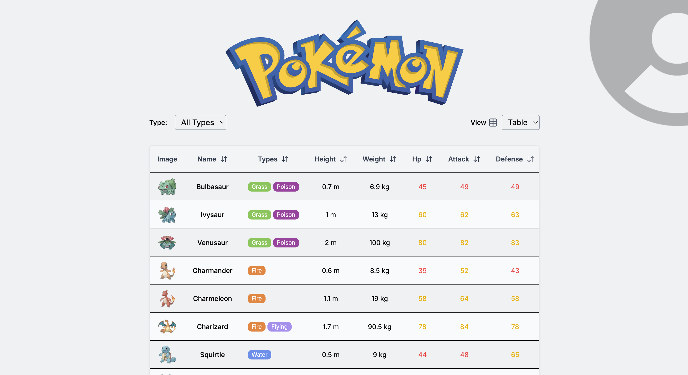
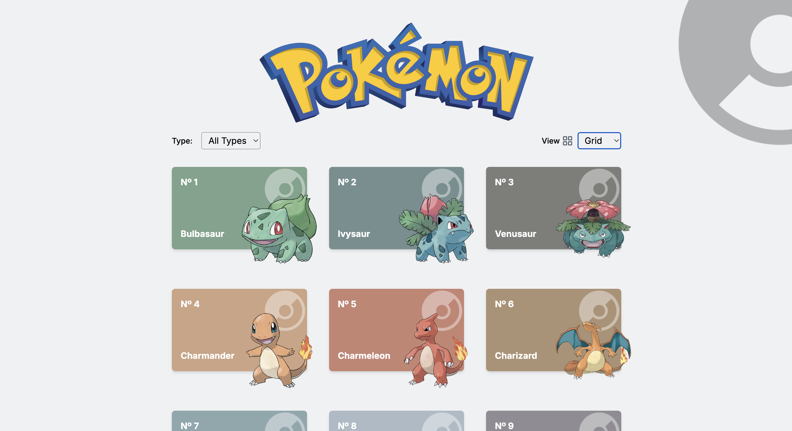
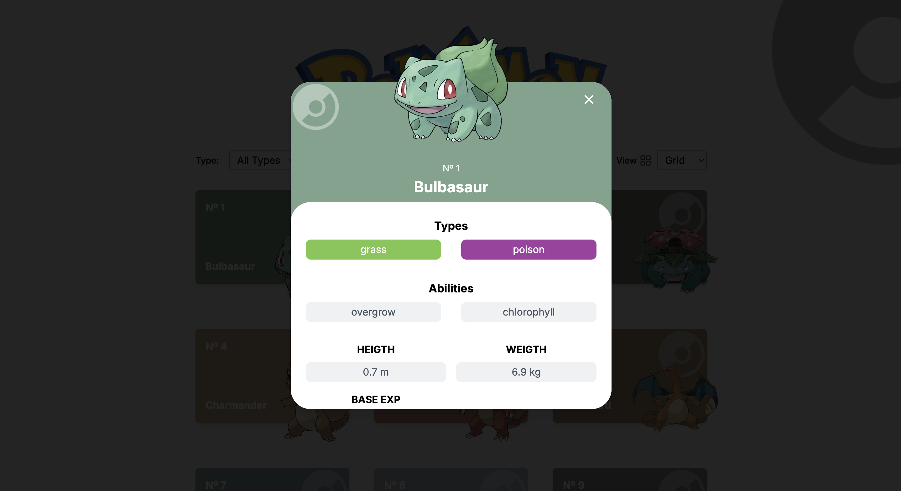

# ⚡️ Pokemon Explorer

**Pokémon Explorer** is a web application built with [Next.js](https://nextjs.org/) that allows users to explore detailed information about Pokémon using the [PokéAPI](https://pokeapi.co/). Users can browse Pokémon in either a grid view or an interactive table.


## 🛠 Tech Stack

- **Framework**: Next.js
- **Data Fetching**: Axios, TanStack Query
- **Table**: TanStack Table
- **Styling**: TailwindCSS
- **Language**: TypeScript
- **Package Manager**: pnpm

 ## 📸 Screenshots

### Table View


### Grid View


### Details


## 🌐 Live Demo

🔗 [View Deployed App](https://pokemon.erikbeltran.dev/)
  
## 🚀 Getting Started

1. Clone/fork the repository and navigate to the project directory.
2. Install dependencies:
```bash
pnpm install
# or
yarn install
# or
npm install
```
3. Start the development server:
```bash
pnpm run dev
# or
yarn dev
# or
npm dev
```

Open [http://localhost:3000](http://localhost:3000) with your browser to see the result.

